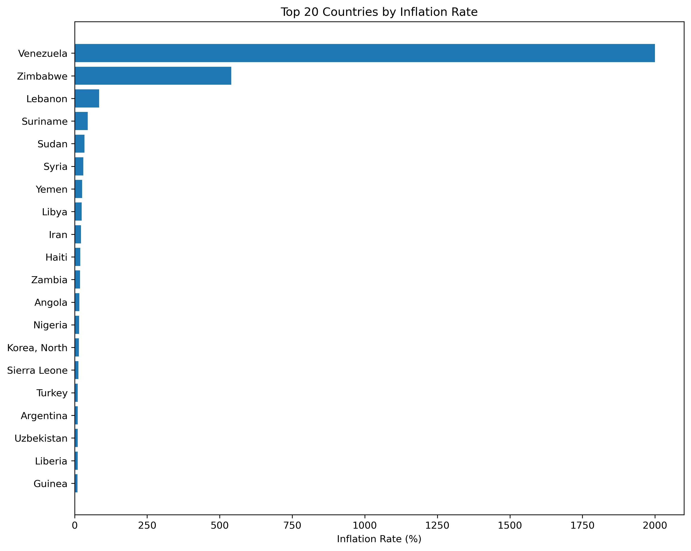
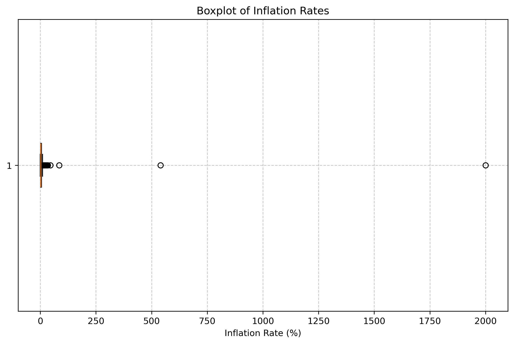
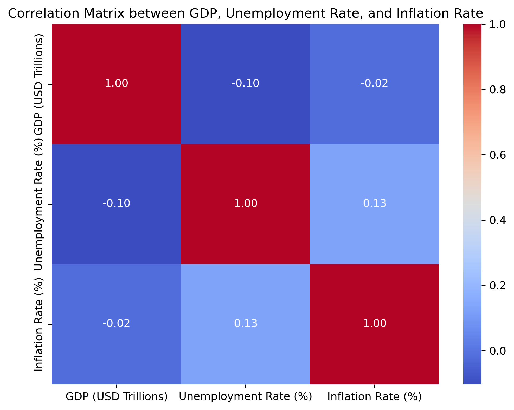

## Introduction

This project investigates whether cross-sectional macroeconomic variables—specifically GDP (USD Trillions) and Unemployment Rate (%)—possess meaningful explanatory power in predicting country-level inflation rates.

The objective is not to maximize predictive performance using complex models, but rather to evaluate the structural relationship between selected macroeconomic indicators and inflation through standard econometric techniques.

## Dataset

The dataset consists of:

-194 countries
,GDP (USD Trillions)
,Unemployment Rate (%)
,Inflation Rate (%)

**Preliminary Observations**
Descriptive statistics and exploratory analysis revealed:

1. A highly right-skewed inflation distribution
2. Presence of extreme hyperinflation outliers (>100%)
3. Weak pairwise correlations between predictors and inflation

**Correlation estimates:**
>Inflation vs. Unemployment: ≈ 0.13 (weak positive)
; Inflation vs. GDP: ≈ 0.00 (negligible relationship)

## Methodology

1. **Outlier Treatment**
To reduce distortion from hyperinflation cases, observations with inflation greater than 100% were excluded from the primary modeling analysis. This allows evaluation of relationships within more stable macroeconomic regimes.

2. **Variance Stabilization**
Given the skewness of inflation, a log transformation was applied whcih reduced heteroskedasticity and improved distributional symmetry.

                    [y=log(1+Inflation)]

3. **Model Specification**

Three regression models were evaluated:

>Linear Regression (OLS)
> ; Ridge Regression (L2 regularization)
> ; Lasso Regression (L1 regularization)
>
Features were standardized prior to modeling.

Model performance was assessed using:

>R² (coefficient of determination)
> ; Mean Squared Error (MSE)

## Results

**Model**	 Linear Regression	≈ **R²** -0.07	≈ **MSE (log scale)**    0.51
**Model**  Ridge Regression	  ≈ **R²** -0.07	≈ **MSE (log scale)**    0.51
**Model**  Lasso Regression 	≈ **R²** -0.02	≈ **MSE (log scale)**    0.48

All models exhibit near-zero or slightly negative R² values, indicating that they perform no better (and in some cases worse) than predicting the mean inflation rate. Regularization does not materially improve explanatory power, suggesting that multicollinearity is not the core limitation.

## Interpretation

The weak model performance indicates that GDP and unemployment rates alone do not provide sufficient explanatory structure for cross-country inflation prediction. This suggests that inflation dynamics are likely driven by additional macroeconomic and institutional factors, such as:

>Monetary policy regimes
> ; Fiscal stability
> ; Exchange rate dynamics
> ; Political and institutional conditions
> ; External shocks

The results reinforce the importance of economic structure and institutional context when modeling macroeconomic outcomes.

## Key Takeaways

1. Model complexity cannot compensate for weak explanatory variables.
2. Regularization does not improve performance when predictive signal is structurally limited.
3. Cross-sectional macroeconomic modeling requires careful variable selection.
4. Inflation is not adequately captured by GDP and unemployment alone.

## Technical Stack

-Python
-Pandas
-NumPy
-Matplotlib
-Seaborn
-Scikit-learn

## Conclusion

1)This study demonstrates that limited macroeconomic indicators possess weak predictive power for cross-country inflation rates in a cross-sectional framework. The primary insight is methodological rather than predictive:

2)When explanatory variables lack structural relationship with the target variable, increasing model sophistication does not meaningfully improve performance. The limitation lies in economic structure, not algorithm choice.

## Key Visualizations

### Top 20 Countries by Inflation

### Inflation Distribution (Boxplot)

### Correlation Heatmap

